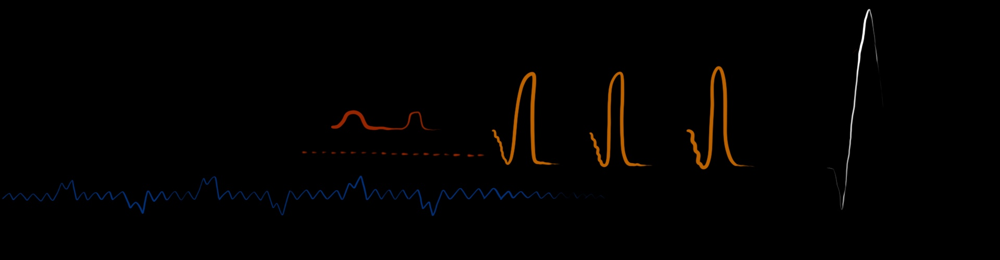

# WEB TYPOGRAPHY 2020

### DE OPDRACHT
Voor Web Typography hebben we een scene gekregen van de film Blade Runner die we aantrekkelijker moeten maken voor Darice. Darice is sinds haar jeugd steeds slechthorender geworden en is nu niet-horend. Voor haar zijn films, met name actiefilms, zoals zij vertelde, niet zo indrukwekkend/ spannend als ze horen te zijn. Dit zijn echter wel de enige films waarvoor ze naar de bioscoop gaat, omdat ze de trillingen van de geluiden kan voelen en ze wel van actiefilms houdt.

Ik moet toegeven dat door de Corona-tijd alle opdrachten behoorlijk minder zijn gegaan. Ik heb sowieso al moeite met plannen en concentreren, maar door het online les hebben gaat dat allemaal nog slechter. Ik heb daardoor best wat achterstand opgelopen. Helaas heb ik door alle chaos in m'n hoofd ook nog een feedbackmoment met Darice en Vasilis gemist. Ik had moeite met het leren van Github en om 'in de opdracht te komen'. Ook had ik heel lang nog geen idee wat ik wou gaan doen. Het is me wel gelukt om labels toe te voegen aan de captions, zodat het duidelijk wie wat zegt. Dit natuurlijk in het juiste font wat daarbij past:

* **Brenner Mono Medium** voor de 'intercomstem'. Deze stem is heel statisch en onpersoonlijk en daarom vond ik dat font er het beste bij passen. 
* **Brenner Script Italic** voor de stem van Officer Joe. Deze 'zachte' vorm van italic vind ik menselijker en biedt een goed contrast tussen de intercomstem en Officer Joe. Daarbij wordt italic ook vaak gebruikt bij quotes en/ of gesproken teksten. 
* **Brenner Sans Bold Italic** voor de onbekende man die "Fuck off, skin-job" roept, heb ik ook een italic font gebruikt om dezelfde reden als hierboven, maar dan een 'harder' font dan dat van Officer Joe, omdat het natuurlijk iets naars is wat hij zegt. 
* **Brenner Slab Bold** voor de interviewer die Officer Joe laat weten dat ze klaar zijn. Ik vond dit font 'menselijk', maar omdat de stem heel resoluut is heb ik voor dit font gekozen.

Uiteindelijk was mijn idee om het geluid letterlijk vorm te geven in de vorm van 'soundwaves'. Hier heb ik een onvoldoende gekregen, omdat het de geluiden uit de film toch niet goed overbracht. Ik ben het daar wel mee eens, want de beelden waarin simpelweg 'te stil'. Terwijl het er juist om gaat dat de scene levendiger wordt voor Darice.



### HERKANSING 20-06-2020
#### Voor de feedback
Voor de herkansing heb ik de soundwaves verwijdert. Ik heb voor nu (voor het feedbackmoment) het eerste deel gevisualiseerd. Ik heb nu gekozen om de geluiden als wat ze zijn te visualiseren. Dus een alarm moet eruit zien als een alarm, een scan moet eruit zien als een scan, etc. Daarbij heb ik natuurlijk ook de juiste kleuren gebruikt om deze geluiden te visualiseren.

#### Na de feedback
Ik heb een steuntje in de rug gekregen dat het er goed uitzag. Dat was een opluchting! Verder kreeg ik als feedback om de cirkel die ik had gebruikt voor ```smallAlarm``` bijvoorbeeld ook voor de ```highPitch``` te gebruiken. Voor het tweede deel van het fragment kreeg ik toen ook gelijk inspiratie!

#### Gevisualiseerde sounds
Voor ```beepingAlarm``` heb ik een klein rood knipperend cirkeltje in de hoek gemaakt. Dit omdat de sound niet heel erg opvalt (dus daarom ook niet over het hele scherm), maar ik vond 'm wel belangrijk genoeg om erin te zetten.


Voor ```heavyAlarm``` heb ik een knalrode schermvullende kleur gekozen, want: heavy!


Voor ```smallAlarm``` heb ik een oranje cirkel gemaakt die achter de ```iframe``` vandaan komt en heel snel groot wordt. Hij is oranje omdat ie minder 'angstaanjagend' is dan de ```heavyAlarm```.


Voor ```scanSound``` heb ik gepriegeld om een echte 'scan' te maken. Eentje die scant (blauw) en goedkeurt (groen). Ik moest het wel even opzoeken hoe ik een _glowing effect_ kon maken.


Voor ```highPitch``` heb ik uiteindelijk gekozen voor wederom een cirkel die achter de ```iframe``` vandaan komt. Deze wordt steeds groter en steeds witter. Ik vond het contrast tussen de zwarte achtergrondkleur en het felle wit passen bij het contrast wat het schelle geluid heeft op de rest van de scene die over het algemeen uit lage tonen bestaat.


Voor ```darkViolins``` heb ik het idee van de cirkel doorgetrokken. Dit keer 'ademt' en verkleurt hij mee met de muziek. Bij hogere tonen wordt de cirkel groter en lichter en bij lagere tonen wordt hij donkerder en kleiner.


Omdat bij ```vibratingPitch``` dezelfde hoge pieptoon terug lijkt te komen alleen dan wat minder constant en trilleriger heb ik gekozen om de ```iframe``` te latem trillen.

Er is op een gegeven moment een heel kort beeping alertje ```beepingAlert``` en die heb ik ook gevisualiseerd. Hij is alleen te kort om er een screencapture van te maken...

#### Kleurenpalet
Als laatste kon ik het niet laten om een kleurenpalet te maken van de film (een ander scene dat wel). Ik wist op een gegeven moment niet zo goed welke kleuren ik nog kon gebruiken, bijvoorbeeld voor de cirkels van ```darkViolins```. Dit kleurenpalet gaf me wat extra inspiratie en daarom heb ik de kleur paars gekozen voor de ```darkViolins```.


### BRONNEN
* Scale: https://codepen.io/afonsopacifer/pen/xVOLVd
* Box shadow (voor glow/ laser effect): https://codersblock.com/blog/creating-glow-effects-with-css/
* Color palette Blade Runner: https://i.pinimg.com/originals/ca/9c/91/ca9c91300cdc0f48649cba2c488c96be.jpg
* Shake effect: https://www.w3schools.com/howto/howto_css_shake_image.asp
